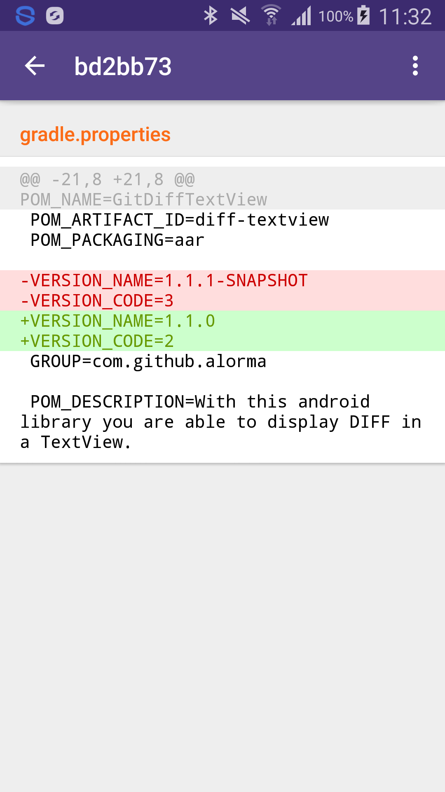

# GitDiffTextView #

With this android library you are able to display DIFF in a TextView.



Usage 
========

Add dependency to your build.gradle file:

``` groovy
    dependencies {
        compile 'com.github.alorma:diff-textview:1.3.0'
    }
```

Add GitDiffTextView to your layout: 

``` xml

<com.alorma.diff.lib.DiffTextView
    android:layout_width="wrap_content"
    android:layout_height="wrap_content"
    android:id="@+id/diffTextView"/>

```

Add diff text:

``` java

DiffTextView diffTextView = (DiffTextView) findViewById(R.id.diffTextView);

String diffText = "@@ -29,6 +29,7 @@
        android:resource=\"@xml/searchable_repos\" />
    </activity>
    <activity android:name=\"com.alorma.github.ui.activity.ProfileActivity\" />
+   <activity android:name=\"com.alorma.github.ui.activity.CommitDetailActivity\" />
    <activity android:name=\"com.alorma.github.ui.activity.RepoDetailActivity\" />
    <activity android:name=\"com.alorma.github.ui.dialog.NewIssueCommentDialog\" />
-   <activity android:name=\"com.alorma.github.ui.activity.FileActivity\" />";

diffTextView.setMaxLines(5);

diffTextView.setText(diffText);

```
